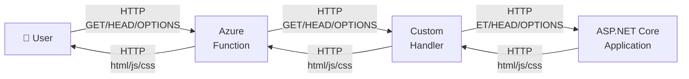

## azure-functions-static-file-server

This repository demonstrates the usage of an [Azure Function custom handler](https://learn.microsoft.com/en-us/azure/azure-functions/functions-custom-handlers) to serve static html assets from an [Azure Function](https://learn.microsoft.com/en-us/azure/azure-functions).




The purpose of this repository is not to replace:

- Azure Static Web Apps
- Azure Storage Static Websites
- App Service

Instead it demonstrates how [Azure Function Custom Handler](https://learn.microsoft.com/en-us/azure/azure-functions/functions-custom-handlers) can host a standard ASP.NET Core application and static assets with minimal Azure Functions-specific code on [Azure AppService Plan Flex Consumption](https://learn.microsoft.com/en-us/azure/azure-functions/flex-consumption-plan).

## Why all this...

Using an [Azure Static Web App](https://azure.microsoft.com/en-us/products/app-service/static) is an option... but this repo is about static html/js/css hosting in a cost effective manner on Azure.

Using an [Azure AppService Plan Flex Consumption](https://learn.microsoft.com/en-us/azure/azure-functions/flex-consumption-plan) has these upsides
- up to [500](https://azure.github.io/AppService/2017/08/08/FAQ-App-Service-Domain-and-Custom-Domains.html) [custom domains](https://learn.microsoft.com/en-us/azure/app-service/overview-custom-domains)
- unlimited [Microsoft Entra ID](https://www.microsoft.com/en-us/security/business/identity-access/microsoft-entra-id) [authentication](https://learn.microsoft.com/en-us/azure/app-service/overview-authentication-authorization)
- extensive Azure regions support
- [virtual network integration](https://learn.microsoft.com/en-us/azure/app-service/overview-vnet-integration)
- very cost effective


I like the Azure Function programming model while being quiet comfortable to not take a dependency on it.

This inspired me... https://anthonychu.ca/post/azure-functions-static-file-server/ ... but felt kind of a lot of code compared to
```csharp
app.UseDefaultFiles(new DefaultFilesOptions { DefaultFileNames = { "index.html" } });
app.UseRouting();
app.MapStaticAssets();
```


The best reason... to fool around and try something and... why not?


## Requirements

- a Bash-compatible shell
- [.NET SDK 10.0](https://dotnet.microsoft.com/en-us/download/dotnet/10.0)
- [Azure Functions Core Tools v4](https://github.com/Azure/azure-functions-core-tools)
- [Azure CLI](https://github.com/Azure/azure-cli) with [Azure CLI extension authV2](https://github.com/Azure/azure-cli-extensions/blob/main/src/authV2/README.rst)<br/>(`az extension add --name authV2 --upgrade --only-show-errors`)
- an Azure Subscription with RBAC permissions on a resource group
  - `Contributor` and `User Access Administrator` or
  - `Owner`

## Build and deploy

Log in to Azure
```
az login
```

and update the resource names in [deploy.sh](./deploy.sh)

```
RG_NAME="<fill_in>"
APP_NAME="$RG_NAME"
STORAGE_NAME="$RG_NAME"
```

and start the deployment

```
chmod +x ./deploy.sh
./deploy.sh
```

## Extend

- Update [wwwroot](./StaticFilesHandler/wwwroot/) with your html assets...
- Extend the `methods` in [http-proxy/function.json](./http-proxy/function.json) for a full blown [ASP.NET Core](https://dotnet.microsoft.com/en-us/apps/aspnet) application.


## local execution

Build the .Net application

```
dotnet publish StaticFilesHandler/StaticFilesHandler.csproj --property:OutputType=Exe --property:PublishSingleFile=true --property:PublishTrimmed=true --property:InvariantGlobalization=true --output dist
```

and start the Azure Function

```
AzureWebJobsStorage="UseDevelopmentStorage=true" func start --custom
```

and visit http://localhost:7071.

To avoid warnings like 
```JSON
[Tag=''] Process reporting unhealthy: Unhealthy. Health check entries are {"azure.functions.web_host.lifecycle":{"status":"Healthy","description":null},"azure.functions.script_host.lifecycle":{"status":"Healthy","description":null},"azure.functions.webjobs.storage":{"status":"Unhealthy","description":"A timeout occurred while running check."}}
```

start the [Azurite emulator](https://learn.microsoft.com/en-us/azure/storage/common/storage-use-azurite)

```
azurite --inMemoryPersistence
```
 
## links
- Azure Functions
  - https://learn.microsoft.com/en-us/azure/azure-functions/functions-custom-handlers
  -  https://json.schemastore.org/host.json
- Azure AppService
  - https://learn.microsoft.com/en-us/azure/app-service/configure-ssl-certificate
  - https://learn.microsoft.com/en-us/azure/azure-functions/functions-scale
  - https://learn.microsoft.com/en-us/azure/azure-functions/flex-consumption-how-to
  - https://json.schemastore.org/host.json
- Azure Static Web Apps Pläne
  - https://learn.microsoft.com/en-us/azure/static-web-apps/plans
  - https://learn.microsoft.com/en-us/azure/static-web-apps/quotas
  - https://learn.microsoft.com/en-us/azure/static-web-apps/faq
  - https://learn.microsoft.com/en-us/azure/static-web-apps/deployment-token-management
- Azure CDN
  - https://learn.microsoft.com/en-us/azure/cdn/classic-cdn-retirement-faq
- Azure Front Door
  - https://learn.microsoft.com/en-us/azure/frontdoor/understanding-pricing
- ASMC-Änderung Juli 2025 / Nachtrag November 2025 — https://go.microsoft.com/fwlink/?linkid=2328307
- MapStaticAssets — https://learn.microsoft.com/en-us/aspnet/core/fundamentals/static-files
- EU Data Boundary, non regional servicel — https://learn.microsoft.com/en-us/privacy/eudb/eu-data-boundary-configure-azure-nonregional-services


## Azure Resource providers
- Microsoft.Storage
- Microsoft.Web