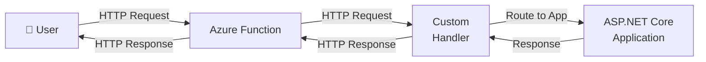

## azure-functions-static-file-server

This repository demonstrates the usage of an [Azure Function custom handler](https://learn.microsoft.com/en-us/azure/azure-functions/functions-custom-handlers) to serve static html assets from an Azure Function.




Let's (ab)use the [Azure Function](https://learn.microsoft.com/en-us/azure/azure-functions) as a networking appliance/proxy/... into 'my' application.

This extend this for non-static html assets, extend the `methods` in [function.json](./function/function.json).

## Why all this...

I liked the `Azure Storage Website with a CDN with a custom domain` pattern and the costs increased due to sundowned services and [Azure Front Door](https://learn.microsoft.com/en-us/azure/frontdoor/front-door-overview) being expensive.

I like the full feature set of the [Azure AppService Plan Flex Consumption](https://learn.microsoft.com/en-us/azure/azure-functions/flex-consumption-plan).

I like the Azure Function progreamming model while being quiet comfortable to not take a dependency on it.

This inspired me... https://anthonychu.ca/post/azure-functions-static-file-server/ ... but felt kind of a lot of code compared to
```csharp
app.UseDefaultFiles(new DefaultFilesOptions { DefaultFileNames = { "index.html" } });
app.UseStaticFiles();
```


The best reason... to fool around and try something and... why not?


## Requirements

- a Bash-compatible shell
- [.NET SDK 10.0](https://dotnet.microsoft.com/en-us/download/dotnet/10.0)
- [Azure Functions Core Tools v4](https://github.com/Azure/azure-functions-core-tools)
- [Azure CLI](https://github.com/Azure/azure-cli) with [Azure CLI extension authV2](https://github.com/Azure/azure-cli-extensions/blob/main/src/authV2/README.rst)<br/>(`az extension add --name authV2 --upgrade --only-show-errors`)
- Azure Subscription and RBAC permissions
  -  `Contributor` and `User Access Administrator` or
  - `Role Based Access Control Administrator` or
  - `Owner`
- permissions to create Microsoft Entra Id applications or own an existing application

## Build and deploy

Run
- `az login`
- `./deploy.sh`

to

1. Publish the .NET project into `dist`
2. Provision resource group, storage account, and Function App (Flex Consumption)
3. Configure managed identity and app settings
4. Configure authentication (Entra ID)
5. Publish app with `func azure functionapp publish`

